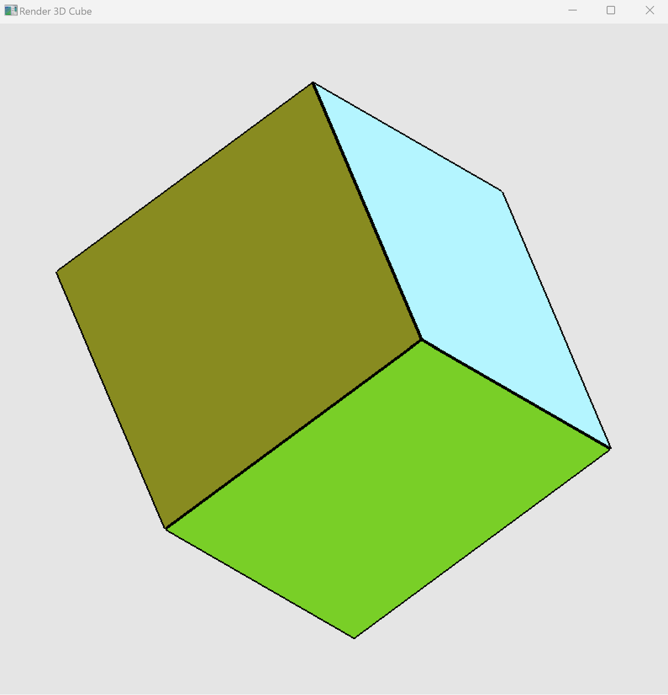

<h1>Rotating Cube</h1>

This OpenGL project demonstrates how to create a rotating 3D cube with colorful faces using C++. Each face of the cube is randomly colored, adding a dynamic visual effect as it rotates along the x, y, and z axes. This program utilizes basic OpenGL and GLUT functions to initialize a display window, handle 3D rendering, and manage viewport resizing. Through this project, I learnt foundational concepts of 3D graphics in OpenGL, including setting up a rendering window, applying transformations, and handling animations with simple rotation.

<h3>Prerequisites</h3>
    <ol>
        <li>
            
<strong>C++ Compiler</strong>: Make sure you have a C++ compiler installed. GCC is common for Linux and
                macOS; Visual Studio is popular for Windows.

        </li>
        <li>
            
<strong>OpenGL and GLUT Libraries</strong>: Install OpenGL and GLUT to render graphics in C++.

            <ul>
                <li>
                    
<strong>Linux</strong>: Install OpenGL and GLUT using:

                    <pre class="!overflow-visible">

bash

<code class="!whitespace-pre hljs language-bash">sudo apt update
sudo apt install freeglut3-dev
</code>

</pre>
                </li>
                <li>
                    
<strong>macOS</strong>: Install OpenGL using <a rel="noopener" target="_new"
                            href="https://brew.sh/"
                            style="--streaming-animation-state: var(--batch-play-state-1); --animation-rate: var(--batch-play-rate-1);">Homebrew</a>:
                    

                    <pre class="!overflow-visible">

bash

<code class="!whitespace-pre hljs language-bash">brew install freeglut
</code>

</pre>
                </li>
                <li>
                    
<strong>Windows</strong>: Install <a rel="noopener" target="_new"
                            style="--streaming-animation-state: var(--batch-play-state-1); --animation-rate: var(--batch-play-rate-1);">freeglut</a>
                        and ensure your project’s linker settings include <code>opengl32.lib</code>,
                        <code>glu32.lib</code>, and <code>glut32.lib</code>.

                </li>
            </ul>
        </li>
    </ol>
    <h3>Step 1: Understanding the Program</h3>
    
The program initializes a window and displays a rotating 3D cube, where each face has a random color. The
        rotation occurs along the x, y, and z axes. Here’s a breakdown of the key components:

    <ul>
        <li><strong>Color Array</strong>: Stores randomized colors for each cube face.</li>
        <li><strong>Rotation Angle</strong>: Controls the rotation speed and angle.</li>
        <li><strong>Functions</strong>:<ul>
                <li><code>initializeOpenGL</code>: Sets up the OpenGL environment and creates the display window.</li>
                <li><code>updateColorArray</code>: Generates random colors for the cube’s faces.</li>
                <li><code>drawFace</code>: Draws a single face of the cube.</li>
                <li><code>drawCube</code>: Calls <code>drawFace</code> for each of the cube’s six faces.</li>
                <li><code>rotateCube</code>: Increments the rotation angle to keep the cube rotating.</li>
                <li><code>onDisplay</code>: Clears the screen and renders the cube each frame.</li>
                <li><code>onReshape</code>: Adjusts the viewport if the window size changes.</li>
            </ul>
        </li>
    </ul>
    <h3>Step 2: Setting Up the Code</h3>
    <ol>
        <li>
            
<strong>Create a New Project/Directory</strong>:

            <ul>
                <li>Open your IDE or text editor.</li>
                <li>Create a new file named <code>OpenGLCube.cpp</code> and paste in the refactored code.</li>
            </ul>
        </li>
        <li>
            
<strong>Code Structure</strong>:
                Make sure the code includes the <code>GL/glut.h</code> library, which is necessary for rendering in
                OpenGL.

        </li>
    </ol>
    <h3>Step 3: Compiling the Program</h3>
    
Open a terminal (or command prompt on Windows) and navigate to the directory where <code>OpenGLCube.cpp</code> is
        located. Compile the code as follows:

    <ul>
        <li>
            
<strong>Linux/macOS</strong>:

            <pre class="!overflow-visible">

bash

<code class="!whitespace-pre hljs language-bash">g++ OpenGLCube.cpp -o OpenGLCube -lGL -lGLU -lglut
</code>

</pre>
        </li>
        <li>
            
<strong>Windows</strong> (Visual Studio Command Prompt):

            <pre class="!overflow-visible">

cmd

<code class="!whitespace-pre hljs language-cmd">g++ OpenGLCube.cpp -o OpenGLCube -lopengl32 -lglu32 -lfreeglut
</code>

</pre>
        </li>
    </ul>
    <h3>Step 4: Running the Program</h3>
    
After successful compilation, run the executable:

    <pre class="!overflow-visible">

bash

<code class="!whitespace-pre hljs language-bash">./OpenGLCube    # On Linux/macOS
OpenGLCube.exe  # On Windows
</code>

</pre>
    <h3>Step 5: Exploring Program Behavior</h3>
    <ul>
        <li><strong>Rotation</strong>: The cube should automatically start rotating. The rotation speed and angle are
            controlled by the <code>rotateCube()</code> function.</li>
        <li><strong>Randomized Colors</strong>: Each face of the cube has a unique color, which is generated randomly at
            the start by <code>updateColorArray()</code>.</li>
        <li><strong>Interaction</strong>: Resize the window to see <code>onReshape()</code> adjust the viewport, keeping
            the cube’s proportions intact.</li>
    </ul>
    <h3>Step 6: Experimenting with the Program</h3>
    <ol>
        <li>
            
<strong>Change Rotation Speed</strong>: In the <code>rotateCube()</code> function, modify the rotation
                speed by adjusting <code>rotationAngle += 0.3f;</code>.

        </li>
        <li>
            
<strong>Adjust Cube Colors</strong>: Customize the cube colors by modifying the
                <code>updateColorArray()</code> function. You could set specific colors rather than random ones if
                desired.

        </li>
        <li>
            
<strong>Window Properties</strong>: Change the initial window size and position in
                <code>initializeOpenGL()</code> by adjusting <code>INITIAL_WIN_WIDTH</code>,
                <code>INITIAL_WIN_HEIGHT</code>, and the window position coordinates in
                <code>glutInitWindowSize()</code> and <code>glutInitWindowPosition()</code>.

        </li>
    </ol>
    <h3>Troubleshooting</h3>
    <ul>
        <li><strong>Missing Library Errors</strong>: If you encounter issues with missing OpenGL or GLUT libraries,
            verify your installation, or check your linker settings.</li>
        <li><strong>Black or White Screen</strong>: If the cube isn’t showing, ensure
            <code>glEnable(GL_DEPTH_TEST);</code> is called, as this is required for correct 3D rendering in OpenGL.
        </li>
    </ul>
    